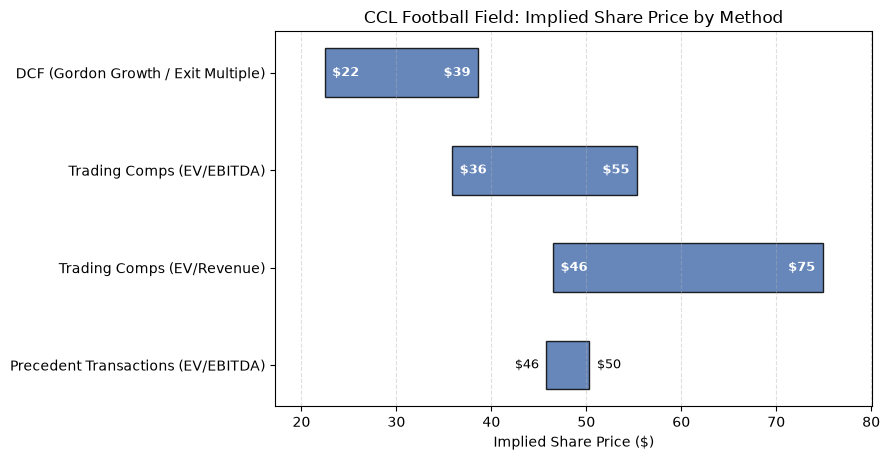
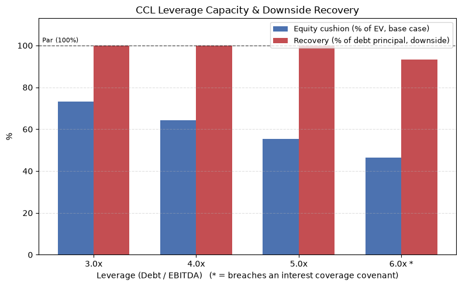

# Valuation Toolkit

[](https://github.com/OWNER/REPO/actions/workflows/tests.yml)

Python valuation engine — DCF, trading comparables, and precedent
transactions — built around a **credit-analysis overlay** that every method
feeds into: given an Enterprise Value from any of the three, what can this
company support in debt, and what does a lender actually recover if it
doesn't work out? 

Run end to end on a real company (**Carnival Corporation, CCL**) in
[`notebooks/walkthrough.ipynb`](notebooks/walkthrough.ipynb) — DCF with a
full WACC build-up and a WACC × terminal-growth sensitivity heatmap,
trading comps against a live-pulled cruise-line peer set, real sourced M&A
precedent transactions, and a leverage-capacity / downside-recovery credit
overlay. Carnival was picked specifically for the credit overlay: its net
leverage peaked around **6.8x at the end of 2023** and has been paid down
to roughly **3.1x–3.4x** since — a real, recent leverage path that the
credit overlay's 3x–6x sweep directly brackets, rather than a hypothetical
stress range.

## Football Field & Credit Overlay





Both charts are real output from the walkthrough notebook, not mockups —
see [Known limitations](#known-limitations) for the full reasoning. The
credit overlay chart is the point of the whole project: at CCL's real
current leverage (~3x), a severe downside still leaves lenders whole; at
6x — close to where Carnival actually sat in 2023 — interest coverage
breaches covenant and equity is wiped out under the same stress. (An
earlier version of this walkthrough ran on Microsoft; at MSFT's scale the
same downside left recovery flat at 100% even at 6x, which is itself a
real finding — see `LIMITATIONS.md` — but a much weaker demonstration of
what this module is for.)

## Repo structure

```
valuation-toolkit/
├── valuation/
│   ├── company.py                  # Company data class + historical UFCF build
│   ├── dcf.py                      # DCF: projection, WACC, terminal value, sensitivity
│   ├── comps.py                    # Trading comparables + football field chart
│   ├── precedent_transactions.py   # Precedent M&A transactions + control premium
│   ├── credit_overlay.py           # THE differentiator: leverage capacity & recovery
│   └── utils.py                    # Shared financial-math helpers
├── data/
│   ├── fetch.py                    # yfinance wrapper + manual-override fallback + cache
│   └── precedent_transactions.csv  # 8 real, individually-sourced M&A deals
├── notebooks/
│   └── walkthrough.ipynb           # End-to-end worked example (Carnival Corp, CCL)
├── tests/                          # pytest — see Testing below
├── docs/images/                    # Screenshots embedded in this README
├── .github/workflows/tests.yml     # CI: runs pytest on every push
├── LIMITATIONS.md                  # Every simplification & open question, stated explicitly
├── LICENSE                         # MIT
├── pyproject.toml
├── requirements.txt
└── README.md
```

## Quick start

```bash
git clone <this-repo-url>
cd valuation-toolkit
pip install -r requirements.txt
jupyter notebook notebooks/walkthrough.ipynb
```

Or as an editable install:

```bash
pip install -e ".[dev]"
pytest
```

`requirements.txt` pins exact versions this was built and tested against —
`yfinance` in particular wraps Yahoo Finance's undocumented internal API
and has broken across versions before, so start there if a fresh install
hits fetch errors.

## Methodology

**`company.py`** — the shared spine. Holds a company's identifying info,
historical financials, and market data, and builds historical unlevered
free cash flow explicitly, step by step (EBIT → NOPAT → +D&A → −Capex →
−ΔNWC), not as a black-box formula. Also owns two data-quality guards
added after real bugs surfaced during development: `latest()` raises
immediately if a requested field is missing rather than silently
propagating NaN, and `assert_single_currency()` blocks any calculation
that would combine a company's quote currency with a different
financial-statement currency (found via direct testing on SAP — see
[Known limitations](#known-limitations)).

**`dcf.py`** — five-year UFCF projection off explicit, reusable
assumptions (revenue growth, EBITDA margin, capex/NWC as % of revenue);
CAPM-based WACC with the full build-up shown, not just the final number;
**both** Gordon Growth and Exit Multiple terminal value methods computed
side by side, deliberately, so the spread between them is visible rather
than picking one; and a WACC × terminal-value sensitivity grid rendered as
an annotated heatmap.

**`comps.py`** — filters an explicit peer candidate list (not a hardcoded
ticker set) by sector and market-cap range, pulls EV/EBITDA, EV/Revenue,
and P/E, and applies the peer set's quartile multiples to the target's own
financials. Also owns the football field chart, shared across DCF, comps,
and precedent-transaction ranges.

**`precedent_transactions.py`** — applies the same median-multiple logic
to eight real, individually-researched M&A deals across two sectors (six
enterprise-software deals, 2014–2022; two cruise-line deals, 2014 and
2018 — each with a cited source in `data/precedent_transactions.csv`)
instead of live API data, which isn't freely available for M&A
transactions. `filter_transactions` narrows to whichever sector matches
the target. Computes an explicit control premium (precedent multiple vs.
trading comps multiple) rather than leaving the standard "deals trade
richer than public comps" claim implicit — and doesn't hide it when that
premium comes out negative (see `LIMITATIONS.md`).

**`credit_overlay.py`** — the differentiator. Takes an Enterprise Value
from any of the three methods above and computes, at each of several
leverage levels a lender might underwrite to: debt quantum, interest
coverage (flagging covenant breaches), and equity cushion — then stresses
EBITDA and the exit multiple down and computes what each leverage tranche
actually recovers in that downside, mirroring the recovery logic in the
companion bond default model.

**`data/fetch.py`** — the only module that talks to yfinance. Wraps price,
shares outstanding, beta, sector, and financial-statement pulls with a
row-name fallback list (yfinance's exact field labels vary by
ticker/sector), a manual-override path for any field, and a local pickle
cache so the notebook doesn't re-hit the API every run.

## Testing

```bash
pytest
```

67 tests across 6 files, all running against hand-verified synthetic data
— no network calls, no live yfinance dependency, so the suite is fast
(under 3 seconds) and deterministic. Covers the pure-math functions
(WACC, both terminal value methods, discounting, multiple statistics),
`Company`'s UFCF build and data-quality guards, and the DCF/comps/
precedent/credit-overlay pipelines end to end on synthetic data. Not
covered: `data/fetch.py` itself, since meaningfully testing a live,
unofficial external API is out of scope for "basic tests for the pure-math
functions" — see `LIMITATIONS.md`.


